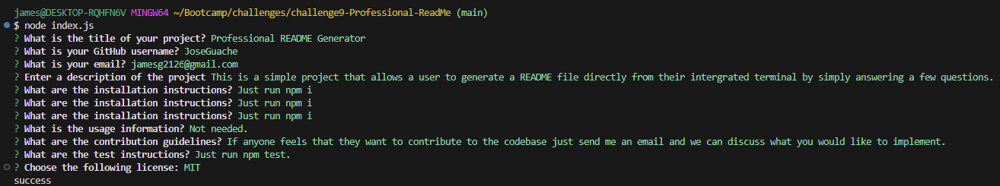
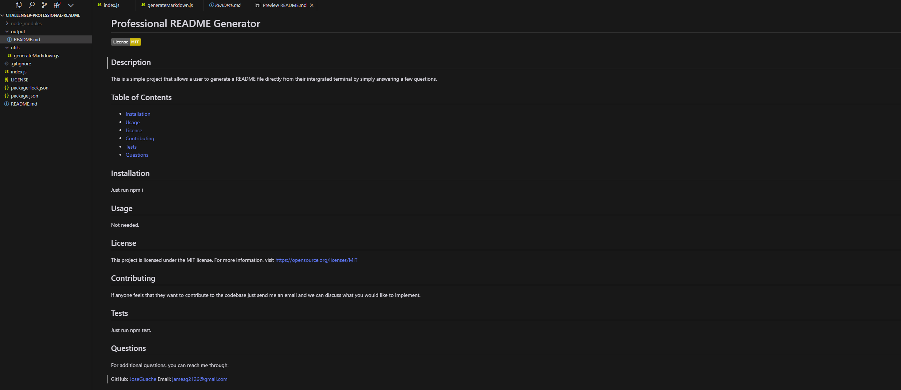

# challenge9-Professional-ReadMe

## Description

This is a simple project that allows a user to generate a README file directly from thier intergrated terminal by simply answering a few questions.

#### Table of Contents

-[Installation](#installation)

-[Usage](#usage)

-[Screenshot](#screenshot)

-[Video](#video)

-[Repo](#repo)

-[Credits](#credits)

-[License](#license)

 
## Installation

Just run npm i.

## Usage

To use this application, simply run the following command in your terminal: node index.js

## Screenshot

---

## Video

<a href="https://drive.google.com/file/d/1OKf3zSz75tXvQsQmA6jVrgq9PiIxjEOh/view">Video demo </a>

## **Repo:**

[Github Repo](https://github.com/JoseGuache/challenge9-Professional-ReadMe)

---

## Credits

[Professional README Guide](https://coding-boot-camp.github.io/full-stack/github/professional-readme-guide) and Professors Starter code.
 
## License

